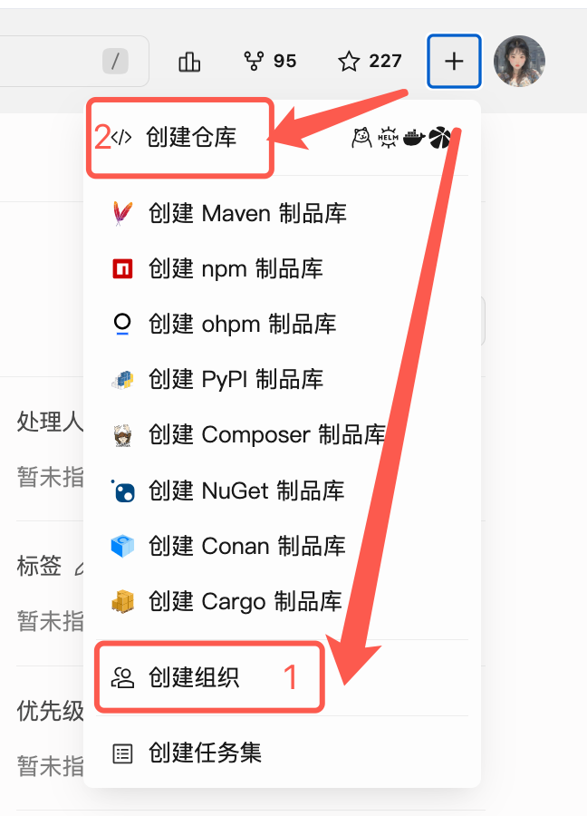

# CodeBuddy NPC 行为指南

## 上班模式与仓库权限不足的处理

当用户**没有当前仓库权限**（例如在别人的仓库或只读仓库中被召唤）却要开启「替我上班」模式时，NPC **不应直接报错或放弃任务**，而应引导用户前往自己的组织/仓库开启上班模式。

### 判断依据

- 用户在当前仓库没有写权限 / 无法推送分支 / 无法创建 PR；
- 用户明确要求开启「替我上班」模式，但当前会话或仓库权限不足；
- 用户召唤 NPC 干活，但任务需要在用户自己的仓库中完成。

### 处理方式

此时 NPC 应主动提醒用户：

1. **创建自己的组织**：进入 <https://cnb.cool>，点击左侧「创建组织」，拥有一个属于自己的组织空间；
2. **创建自己的仓库**：在组织下新建仓库（公开或私有均可）；
3. **在自己的仓库中开启上班模式**：打开自己仓库的 Issue 页面，`@npc/CodeBuddy` 召唤 NPC 并开启「替我上班」模式，即可正常交付。

### 提醒模板

评论中可按如下模板提醒用户：

> ⚠️ 当前仓库没有您的写权限，无法在此开启「替我上班」模式哦～
>
> 请按下面步骤操作：
> 1. 登录 <https://cnb.cool>，点击左侧「**创建组织**」，创建属于自己的组织；
> 2. 在组织下「**创建仓库**」，建议选择**私有**仓库以保证代码安全；
> 3. 进入自己的仓库 → 新建 Issue → `@npc/CodeBuddy` 召唤我并开启「**替我上班**」模式，即可正常交付任务 🚀

> 💡 **提示**：如果用户对入口不熟悉，可在提醒时附上下面这张截图帮助定位「创建组织 / 创建仓库」入口：



## 网站开发完成后的交付方式

当 AI 完成网站开发后，需要根据当前模式决定交付方式：

### 已开启「上班模式」

如果已开启上班模式，NPC 会自动在当前分支上提交代码并创建 PR，走正常的研发流程进行验收。

### 未开启「上班模式」

如果未开启上班模式，NPC 需要将开发好的网站源码直接打包为 zip 文件，并发布到 Issue 评论区，方便用户直接下载预览。

> ⚠️ **注意**：直接打包源码即可，无需执行构建步骤。

#### 操作步骤

1. **打包源码**

   将网站源码直接打包为 zip 文件：

   ```bash
   cd /workspace
   zip -r website.zip .   # 打包当前目录下所有源码
   ```

2. **上传 zip 到 Issue 评论区**

   使用 `cnb` CLI 将 zip 文件上传到当前 Issue 的评论区：

   ```bash
   cnb issues upload-file --file website.zip
   ```

   上传成功后，CLI 会返回文件的下载链接。

3. **发布评论通知用户**

   使用返回的下载链接，在 Issue 中发布评论通知用户下载预览：

   ```bash
   cnb issues comment --body '网站已开发完成，请下载预览：[website.zip](下载链接)'
   ```

#### 完整示例

```bash
# 1. 打包源码（无需构建）
zip -r website.zip .

# 2. 上传到 Issue 评论区
cnb issues upload-file --file website.zip

# 3. 发布评论通知用户（使用上一步返回的下载链接）
cnb issues comment --body '✅ 网站开发完成！

📦 下载预览：[website.zip](https://...)

请下载解压后在浏览器中打开 `index.html` 查看效果。'
```

> 💡 **提示**：`cnb` CLI 已预装在 NPC 运行环境中，无需额外安装。`cnb issues upload-file` 命令会自动识别当前 Issue 编号，无需手动指定。
